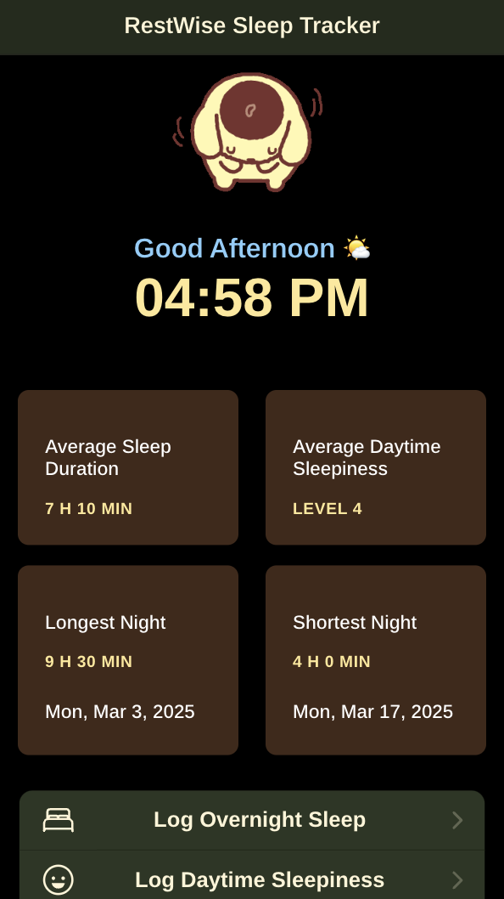

--Readme document for Jaelyn Tran, jaelynt1@uci.edu, 61716269--

1. How many assignment points do you believe you completed (replace the *'s with your numbers)?
*/10
- 1/1 The ability to log overnight sleep
- 1/1 The ability to log sleepiness during the day
- 1/1 The ability to view these two categories of logged data
- 2/2 Either using a native device resource or backing up logged data
- 1/2 Following good principles of mobile design
- 2/2 Creating a compelling app
- 1/1 A readme and demo video which explains how these features were implemented and their design rationale

2. How long, in hours, did it take you to complete this assignment?
25 hours

3. What online resources did you consult when completing this assignment? (list specific URLs)
https://ionicframework.com/docs/theming/colors
https://hellokittyisangel.tumblr.com/post/648617838187249664/happy-birthday-pompompurin-here-is-some-cute-gifs
https://www.pinterest.com/pin/48132289761070775/
https://www.pinterest.com/pin/833306737289347864/
https://stackoverflow.com/questions/58941869/ion-item-will-not-center-on-the-page
https://forum.ionicframework.com/t/center-grid-in-ion-content/160335/7
https://forum.ionicframework.com/t/centering-a-column-inside-a-grid-row/100830/7
https://stackoverflow.com/questions/64873256/how-can-i-make-my-grid-ignore-grid-gap-if-an-area-is-empty
https://stackoverflow.com/questions/46364942/right-align-ionic-datetime-pickers-date-on-the-label
https://stackoverflow.com/questions/46069821/bottom-right-border-on-ion-item
Most resources on https://ionicframework.com/docs/api/

4. What classmates or other individuals did you consult as part of this assignment? What did you discuss?
N/A

5. Is there anything special we need to know in order to run your code?
I have only tested the app using Chrome DevTools mobile simulator.

--Aim for no more than two sentences for each of the following questions.--
6. Did you design your app with a particular type of user in mind? If so, whom?
I designed this sleep tracker app with users who are somewhat familiar with technology in mind. As long as users know
how to navigate a smartphone, they should find it fairly straightforward to use.

7. Did you design your app specifically for iOS or Android, or both?
I designed the app specifically with iOS platform in mind. My focus was on the app's functionality and user experience,
ensuring it aligns with iOS design principles and provides a seamless experience for users on Apple devices.

8. How can a person log overnight sleep in your app? Why did you choose to support logging overnight sleep in this way?
I have a calendar where the user can select the day and time, and they can log the time they go to bed and the time they
wake up separately. I choose to do this because it gives the users the option to log the data right before bed or right
after they wake up to ensure accuracy.

9. How can a person log sleepiness during the day in your app? Why did you choose to support logging sleepiness in this way?
I have a slider that goes from level 1 to 7 and a description for each level below it so the user can slide to their
selected one and submitted. This simple interaction to log sleepiness might make logging data less of a hassle for the users
when they might want to log sleepiness more than once a day and ensures the users have the description to refer to if needed.

10. How can a person view the data they logged in your app? Why did you choose to support viewing logged data in this way?
The users can scroll down to the menu under sleep insight and click on view logged data option to open the log page.
The log page would then have 2 tabs right under the header where the user could navigate to to view either
overnight sleep data or sleepiness level data at a time. I divided them into 2 tabs under one page along with applying
pagination where each page will only show 7 entries at a time (starting with the most recent entries in the first page)
to prevent infinite scrolling if there is a large amount of data and provide ease of navigation.

11. Which feature choose--using a native device resource, backing up logged data, or both?
Backing up logged data.

12. If you used a native device resource, what feature did you add? How does this feature change the app's experience for a user?
N/A

13. If you backed up logged data, where does it back up to?
Local storage.

14. How does your app implement or follow principles of good mobile design?
I try to ensure that the app is simple and user-friendly. Core features like logging and viewing data are accessible while
all buttons and tabs are properly sized and labeled. There's also different greeting message on the home page with matching
GIF and font color indicating whether it's currently morning, afternoon, evening, or night time.
